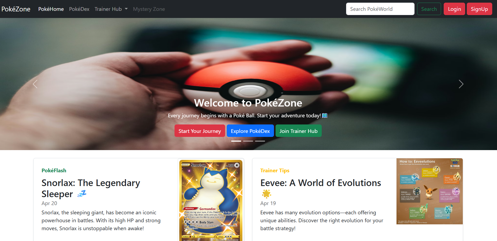

<!-- Anchor for Back to Top -->

# 🧿 PokéZone

  <em>
    A <b>beginner-friendly web project</b> built using  
    <b>Bootstrap 5</b> to explore responsive design and UI components.
  </em>

---

## 🌐 Overview

  <em>
    <b>PokéZone</b> is a simple Pokémon-themed website created during my early
    learning phase of <b>Bootstrap</b>.  
    The main goal of this project was to understand how Bootstrap helps in
    building <b>responsive</b>, <b>structured</b>, and <b>visually appealing</b>
    webpages without writing custom CSS.
  </em>

  <em>
    This project focuses purely on using <b>Bootstrap classes and components</b>
    such as navbar, modals, carousel, cards, grid system, and utilities.
  </em>

---

## 🔗 Live Demo

  <em>
    👉 <a href="https://stunning-starburst-aac183.netlify.app/#"><b>PokéZone – Live Preview</b></a>
  </em>

---

## ✨ Key Features

  <em>
    🧭 <b>Responsive Navigation Bar</b> — Built using Bootstrap’s navbar component
    with dropdown menus and collapsible layout.
  </em>

  <em>
    🔐 <b>Login & Signup Modals</b> — Implemented using Bootstrap modal components
    with form elements and validation styles.
  </em>

  <em>
    🎠 <b>Image Carousel</b> — Interactive carousel showcasing Pokémon-themed
    slides with captions and action buttons.
  </em>

  <em>
    📦 <b>Bootstrap Grid Layout</b> — Content cards arranged using the grid system
    for better responsiveness.
  </em>

  <em>
    📱 <b>Fully Responsive Design</b> — Automatically adapts to mobile, tablet,
    and desktop screens.
  </em>

---

## 🧰 Tech Stack

  
  

  <em>
    Built using <b>HTML5</b> and <b>Bootstrap 5</b> (CDN).  
    No custom CSS or JavaScript was used.
  </em>

---

## 📁 Pages Included

  <em>
    🏠 <b>Home Page</b> — Features navbar, carousel, featured Pokémon cards, and
    footer.
  </em>

  <em>
    📘 <b>PokéDex Page</b> — Displays Pokémon-related images using responsive
    Bootstrap utilities.
  </em>

---

## 🧠 What I Learned

  <em>
    Through this project, I learned how to:
  </em>

<ul>
  <li>Use Bootstrap’s <b>grid system</b> effectively</li>
  <li>Build responsive <b>navigation bars</b></li>
  <li>Implement <b>modals</b> and <b>carousels</b></li>
  <li>Structure layouts without writing custom CSS</li>
  <li>Understand the power of <b>utility classes</b></li>
</ul>

---

## 👤 Creator

  <em>
    <b>Subham Kolay</b> 
    BTech <b>Computer Science</b> Undergraduate 
    Learning <b>Web Development</b> step by step
  </em>

  <em>
    This project was created as part of my initial journey into
    <b>Bootstrap-based frontend development</b>.
  </em>

---

## ⭐ Support

  <em>
    If you found this project helpful or interesting, feel free to give it a ⭐  
    as it motivates me to keep learning and building more projects.
  </em>

---

  

